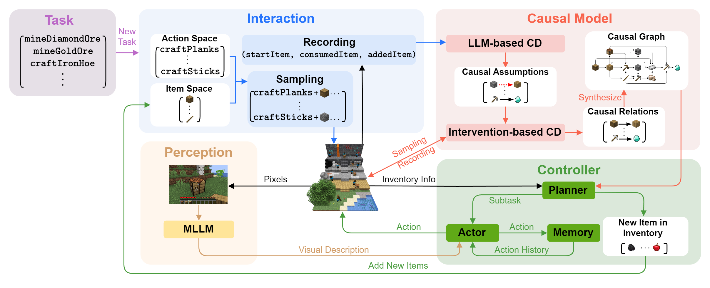

# ADAM: An Embodied Causal Agent in Open-World Environments

<div align="center">

[[Website]](https://opencausalab.github.io/ADAM)
[[Arxiv]](https://arxiv.org/abs/2410.22194)
[[PDF]](https://arxiv.org/pdf/2410.22194)

[](https://github.com/OpenCausaLab/ADAM)
[](https://github.com/OpenCausaLab/ADAM)
______________________________________________________________________

</div>

We introduce ADAM, An emboDied causal Agent in Minecraft, that can autonomously navigate the open world, perceive multimodal contexts, learn causal world knowledge, and tackle complex tasks through lifelong learning.
ADAM is empowered by four key components: 1) an interaction module, enabling the agent to execute actions while documenting the interaction processes; 2) a causal model module, tasked with constructing an ever-growing causal graph (i.e., technology tree) from scratch, which enhances interpretability and diminishes reliance on prior knowledge; 3) a controller module, comprising a planner, an actor, and a memory pool, which uses the learned causal graph to accomplish tasks; 4) a perception module, powered by multimodal large language models, which enables ADAM to perceive like a human player. Our project page is at [https://opencausalab.github.io/ADAM](https://opencausalab.github.io/ADAM)



Extensive experiments show that ADAM accurately constructs an almost perfect causal graph, enabling effective task decomposition and execution with increased efficiency and strong interpretability. Additionally, in modified Minecraft scenarios where no prior knowledge is available, ADAM maintains its performance and shows remarkable robustness and generalization capability.

We provide the implementation of ADAM in this repo. We employ [Mineflayer](https://github.com/PrismarineJS/mineflayer),
a JavaScript-based framework designed for integration with the commercial Minecraft. For visual
processing, we utilize [prismarine-viewer](https://github.com/PrismarineJS/prismarine-viewer), an API for visualizing
Minecraft content. The encapsulation of the Mineflayer uses the implementation
in [VOYAGER](https://github.com/MineDojo/Voyager).

# Installation

ADAM requires Python ≥ 3.9 and Node.js ≥ 16.13.0. Our experiment tested the Minecraft environment on the **Windows**
platform. The Azure Cloud Service is also available in the implementation.

## Python Install

```
git clone https://github.com/OpenCausaLab/ADAM
cd ADAM
pip install -e .
```

## Node.js Install

In addition to the Python dependencies, you need to install the following Node.js packages:

```
cd env/mineflayer
npm install -g npx
npm install
cd mineflayer-collectblock
npx tsc
cd ..
npm install
```

For users from mainland China, we recommend the following installation method:

```
cd env/mineflayer
npm config set registry https://registry.npmmirror.com
npm install -g npx
npm install
cd mineflayer-collectblock
npx tsc
cd ..
npm install
```

## Minecraft Instance and Fabric Mods Install

The tutorial is from [VOYAGER](https://github.com/MineDojo/Voyager).

### Minecraft Instance Install

Follow the instructions in [Minecraft Login Tutorial](installation/minecraft_instance_install.md) to set up your
Minecraft Instance.

### Fabric Mods Install

Follow the instructions in [Fabric Mods Install](installation/fabric_mods_install.md) to install the mods.

# Getting Started

You can run ADAM by:

```python
from Adam.ADAM import ADAM

with open("API_key.txt", 'r') as key_file:
    openai_api_key = key_file.read()

ADAM = ADAM(
    mc_port=52832,
    llm_model_type='gpt-4-turbo',
    use_local_llm_service=False,
    openai_api_key=openai_api_key,
    parallel=True
)

ADAM.explore(['diamond'], [])
```

# Resume from a checkpoint

Our implementation has methods for automatic saving and automatic loading of checkpoints. If you want to continue from a
checkpoint, you can use the following code.

```python
from Adam.ADAM import ADAM

with open("API_key.txt", 'r') as key_file:
    openai_api_key = key_file.read()

ADAM = ADAM(
    mc_port=52832,
    llm_model_type='gpt-4-turbo',
    use_local_llm_service=False,
    openai_api_key=openai_api_key,
    auto_load_ckpt=True,
    parallel=True
)

ADAM.explore(['diamond'], [])
```

If you want to continue from a specific checkpoint, you can use the following code.
```python
from Adam.ADAM import ADAM

with open("API_key.txt", 'r') as key_file:
    openai_api_key = key_file.read()

ADAM = ADAM(
    mc_port=52832,
    llm_model_type='gpt-4-turbo',
    use_local_llm_service=False,
    openai_api_key=openai_api_key,
    load_ckpt_path='your_ckpt_path',
    parallel=True
)

ADAM.explore(['diamond'], [])
```

# Paper and Citation

```bibtex
@article{yu2024adam,
  title   = {ADAM: An Embodied Causal Agent in Open-World Environments},
  author  = {Shu Yu and Chaochao Lu},
  year    = {2024},
  journal = {arXiv preprint arXiv:2410.22194}
}
```
